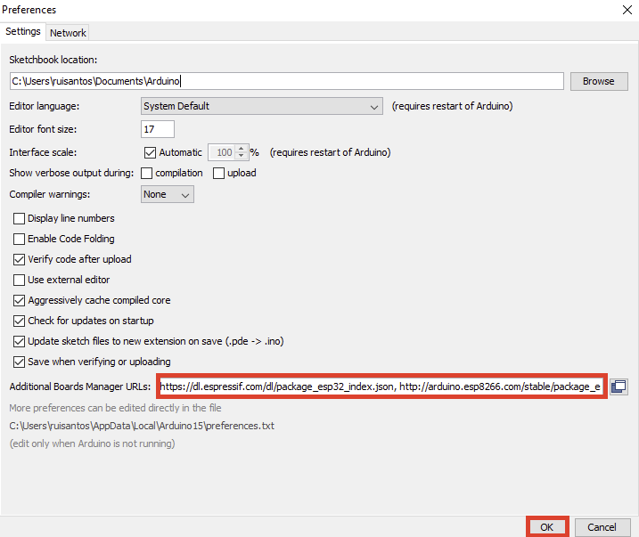

# Guia de Implementación de Libreria BSEC de Bosch en Arduino IDE

## Pasos A Seguir:
1. Instalar Arduino IDE
2. Instalar GIT
3. Clonar repositorio
4. Agregar el siguiente URL al Gestor de URLs Adicionales de Tarjetas:
`https://dl.espressif.com/dl/package_esp32_index.json`

5. Instalar el módulo del ESP32 en el gestor de tarjetas, asegurarse de instalar la versión 1.0.4
6. Instalar las siguientes librerías:
    * PubSubClient
    * NTPClient
    * Adafruit BME680 Library (incluir dependencias)
    * DallasTemperature (incluir OneWire)
    * Adafruit PM25 AQI Sensor
    * BSEC Sofware Library
7. Navegar a la carpeta de instalación del esp32 y reemplazar el archivo `platform.txt` con el que se encuentra en el repositorio. La debe lucir de la siguiente forma: `.arduino15/packages/esp32/hardware/esp32/1.0.4`
8. Seleccionar la tarjeta `ESP32 Wrover Module` y compilar.

## Videos Demostrativos:

[Link de carpeta de Google Drive](http://bit.ly/38pbQxF)
